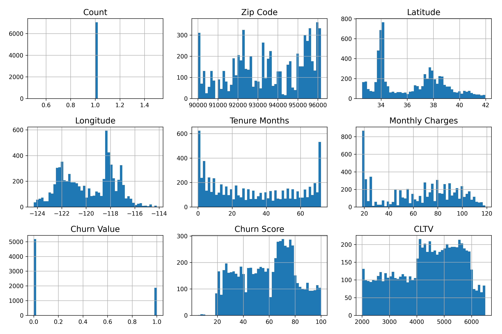
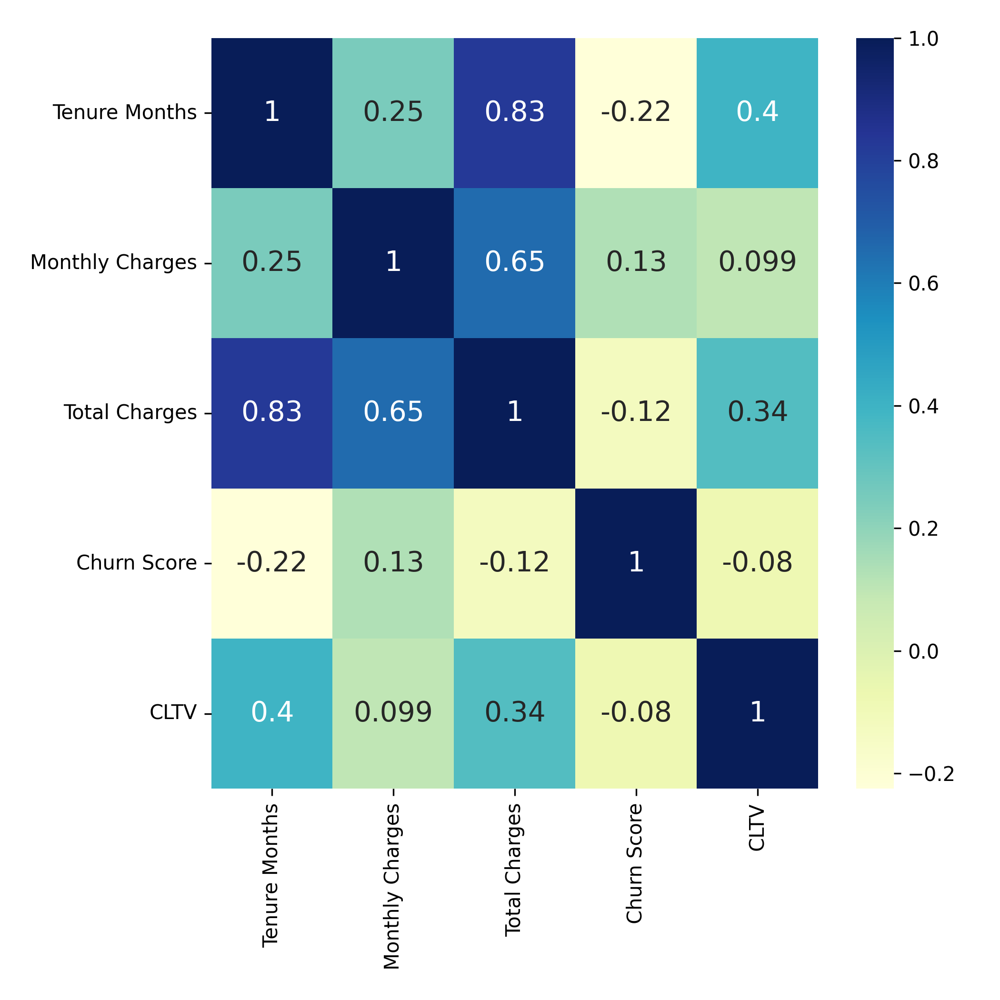
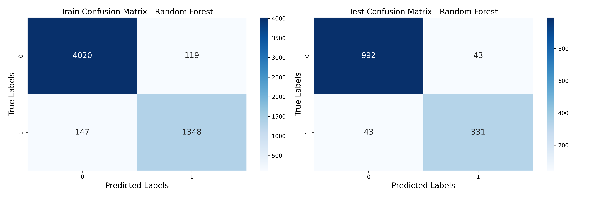
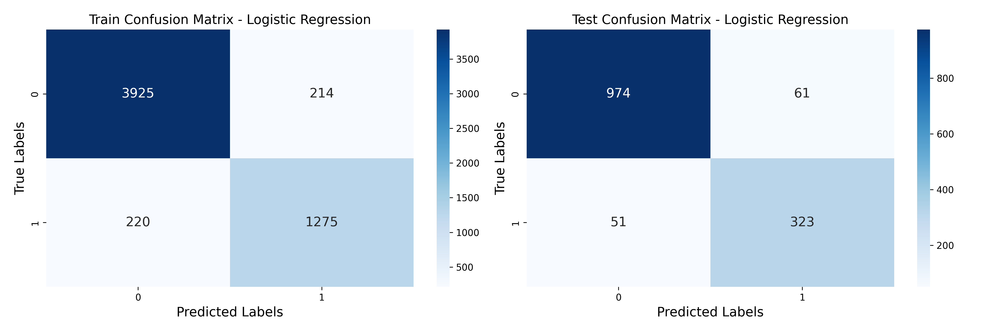

# Customer-Churn-Prediction-using-Machine-Learning
A fictional telco company that provided home phone and Internet services data  from customers in California  to predict their future churning rate with machine learning

# Requirements 
- Pandas
- NumPy
- Scikit-Learn
- Matplotlib
- Seaborn

# Data Visualization 

# Corelation Matrix 

# Reuslt (Confusion Matrix)

## Random Forrenst Model 

## Logistic Regression Model

